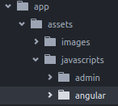

While Ruby on Rails is great for quick and easy app development, the synchronous requests can be a real drag -- literally. AngularJS is clean, elegant, and super fast on the client-side, with its beautiful promises and async style. What if you want the best of both worlds? Using ngResource in Angular essentially turns your Rails application into an internal API, seamlessly piggybacking your robust Rails framework... without the bulkiness of Rails dragging you down.

<!--more-->

**For this article, I'm going to assume you have an existing RoR application with AngularJS added**

## Break out of your Angular
For most use cases, when we use AngularJS with Rails, we'll usually contain the small amount of code to one single file named something like `angular.js` within `app/assets/javascripts/`. While this is fine for minimal use, we're going to be throwing most of our logic into AngularJS to speed things up.

Let's create a new directory within `javascripts/` and name it `angular`.

Now, we'll move our `angular.js` files inside this folder. As we create more Angular code, we'll break it out accordingly.
